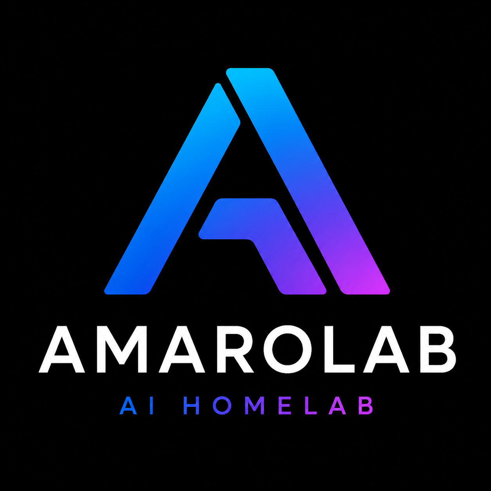
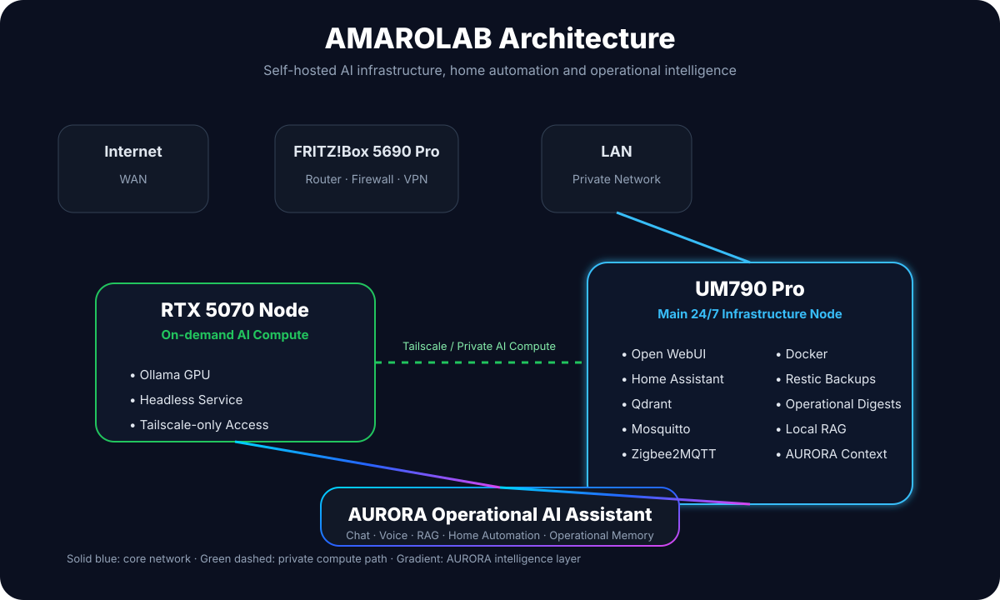

<div align="center">

<!-- ========================= -->
<!--          BANNER           -->
<!-- ========================= -->

<p align="center">
  
</p>

### Designing, building and documenting a production-grade AI Homelab.

*Everything is self-hosted. Everything is documented. Everything is validated.*


</div>

---

# What is AMAROLAB?

AMAROLAB is my long-term **AI Infrastructure Laboratory**.

It is a production-grade self-hosted environment where I design, build, validate and document every component required to operate a modern AI ecosystem.

Rather than deploying isolated services, every system is engineered as part of a coherent platform focused on:

- Artificial Intelligence
- Infrastructure Engineering
- Home Automation
- Operational Excellence
- Knowledge Systems
- Digital Sovereignty

This repository contains both the production infrastructure and the complete engineering documentation behind it.

---

# Architecture

<p align="center">
  
</p>

---

# AURORA

<p align="center">

</p>

**AURORA** is the intelligence layer running on top of the infrastructure.

Its long-term objective is to become an operational AI assistant capable of understanding the complete state of the platform through:

- Local LLMs
- Operational Memory
- Home Assistant
- Local RAG
- Infrastructure Monitoring
- Long-term Knowledge
- Operational Context

---

# Core Technologies

## AI

- Open WebUI
- Ollama
- Qwen 2.5
- Qdrant
- Local RAG
- Operational Memory
- AURORA

---

## Infrastructure

- Docker
- Linux
- Home Assistant
- Mosquitto
- Zigbee2MQTT
- FRITZ!Box
- WireGuard VPN

---

## Operations

- Restic Backups
- Operational Digests
- Continuous Validation
- Disaster Recovery
- Architecture Reviews
- Git-based Documentation

---

# Current Progress

| Area | Status |
|------|:------:|
| Infrastructure Foundation | ✅ |
| Local AI Platform | ✅ |
| Voice Assistant | ✅ |
| Operational Awareness | ✅ |
| Operational Memory Foundation | ✅ |
| Autonomous Operations | 🚧 |

---

# Repository Structure

```text
homelab/

├── 00_overview/
├── 01_architecture/
├── 02_infrastructure/
├── 03_services/
├── 04_ai_system/
├── 05_data/
├── 06_security/
├── 07_operations/
├── 08_projects/
└── 09_logs/
```

---

# Engineering Principles

> **Reality always wins.**

Every deployment follows exactly the same engineering workflow.

```text
Design
   ↓
Implement
   ↓
Validate
   ↓
Document
   ↓
Commit
   ↓
Publish
```

Core principles:

- Documentation First
- Reality Always Wins
- Validate Before Publishing
- Security Before Convenience
- No Secrets In Git
- Every Change Is Traceable

---

# Why this project?

Most homelabs are collections of services.

AMAROLAB is different.

Every deployment is treated as production.

Every architectural decision is documented.

Every validation is reproducible.

Every failure becomes documentation.

The objective is not simply to build a homelab.

It is to become a better infrastructure engineer by building one.

---

# Current Focus

## Phase F — Operational Intelligence

Current work focuses on giving AURORA operational awareness through:

- Infrastructure Monitoring
- Operational Memory
- Retrieval-Augmented Generation (RAG)
- Home Assistant Integration
- Local AI Reasoning
- Continuous Validation

---

# Related Projects

| Project | Description |
|----------|-------------|
| **AURORA** | Personal AI Assistant |
| **Guardian Cloud** | Personal Evidence Platform |
| **MyFreeTour** | AI Tourism Platform |
| **diegoamaro.dev** | Personal Website & Portfolio |

---

# Documentation

Every milestone includes:

- Architecture Decisions
- Apply Logs
- Validation Logs
- Rollback Procedures
- Lessons Learned
- Git History

> **If it isn't documented, it doesn't exist.**

---

<div align="center">

## Build → Validate → Document → Improve

*"The real product isn't the infrastructure.*

*The real product is the engineer built while creating it."*

</div>